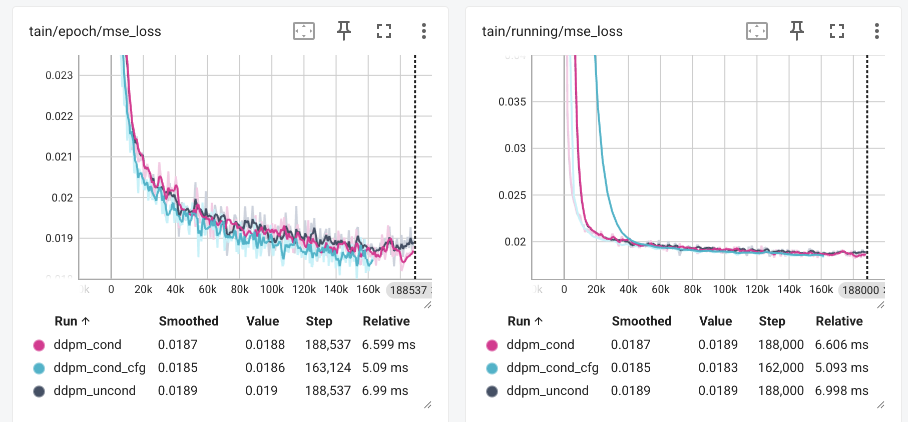

# Denoising Diffusion Probabilistic Models on CelebA

This repository contains code to train a **DDP** model on the CelebA dataset.

The project is inspired by the "**Denoising Diffusion Probabilistic Models**" paper, but streamlined to work with a single dataset (CelebA) for simplicity.


# Setup

## Clone repository

```bash
git clone <your-repo-url>
cd <repo-name>
```

## Install dependencies

[Install pytorch](https://pytorch.org/)

```bash
pip install -r requirements.txt
```

## Download Celeba 256 dataset

[From Kaggle](https://www.kaggle.com/datasets/badasstechie/celebahq-resized-256x256)

# Training
Every experiment took ~15 hours (200 epochs) using 1x Nvidia 4090 GPUs.

### Unconditional DDPM

```bash
python src/train_ddpm.py data_path=<path-to-celeba-dataset> log_dir=<where-to-store-logs>
```

### Conditional DDPM

```bash
python src/train_ddpm.py --config-name=train_ddpm_class_cond cfg_scale=0 data_path=<path-to-celeba-dataset> log_dir=<where-to-store-logs>
```

### Conditional DDPM + Classifier Free Guidance

```bash
python src/train_ddpm.py --config-name=train_ddpm_class_cond data_path=<path-to-celeba-dataset> log_dir=<where-to-store-logs>
```

## Training loss



# Inference

### Unconditional generation
```bash
python scripts/generate_images.py ckpt_path=<path-to-ckpt>
```

### Conditional generation
```bash
python scripts/generate_images.py --config-name=generate_images_cond ckpt_path=<path-to-ckpt> cfg_scale=3.0
```

### Conditional generation + CFG
```bash
python scripts/generate_images.py --config-name=generate_images_cond ckpt_path=<path-to-ckpt> cfg_scale=3.0
```


## Acknowledgments

1. [Denoising Diffusion Probabilistic Models](https://arxiv.org/pdf/2006.11239)
2. [Video explanation](https://www.youtube.com/watch?v=HoKDTa5jHvg) | [Video implementation](https://www.youtube.com/watch?v=TBCRlnwJtZU)

## Notes

This project is simplified for research/educational purposes and focuses only on the CelebA dataset.
